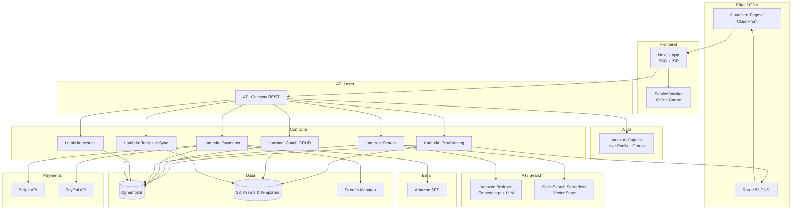
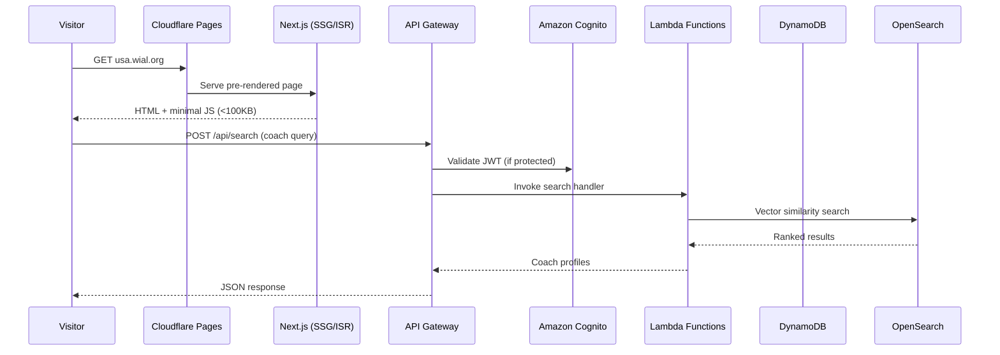
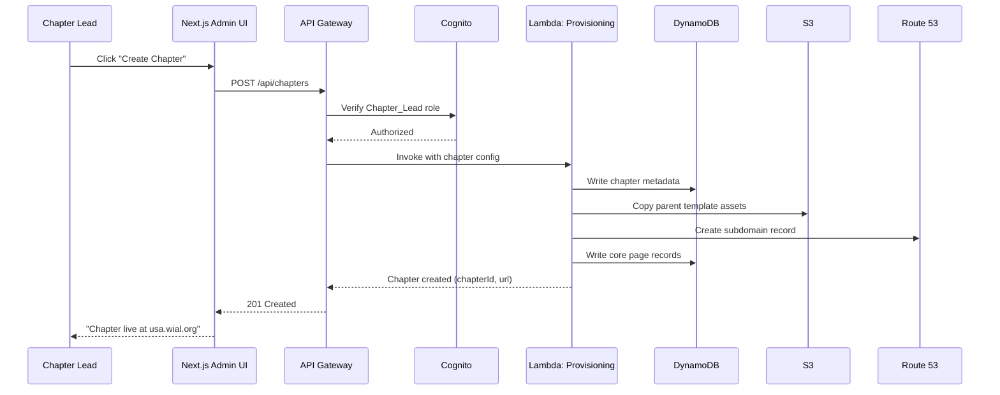
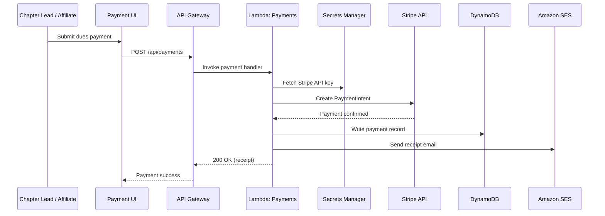

# Design Document: WIAL Chapter Platform

## Overview

The WIAL Chapter Platform is a multi-site web application that enables the World Institute for Action Learning to manage its global chapter network. The platform consists of a Global Site (wial.org) and dynamically provisioned Chapter Sites (e.g., usa.wial.org), all sharing a unified brand template. Key capabilities include one-click chapter provisioning, role-based access control via Amazon Cognito, Stripe/PayPal dues collection, a global coach directory with AI-powered cross-lingual semantic search, and a Super Admin revenue dashboard.

The system follows a serverless-first architecture on AWS, with a Next.js frontend deployed to Cloudflare Pages (or AWS Amplify), AWS Lambda (Python) for backend compute, DynamoDB for data persistence, and Amazon Bedrock + OpenSearch Serverless for the AI semantic search pipeline.

## Architecture

### High-Level System Architecture



### Request Flow



### Chapter Provisioning Flow



### Payment Processing Flow



## Components and Interfaces

### Frontend Components

The Next.js application uses the App Router pattern with the following structure:

```
frontend/
├── app/
│   ├── layout.tsx                  # Root layout with global header/footer (locked template)
│   ├── page.tsx                    # Global site scroll-down landing page
│   ├── [chapter]/
│   │   ├── layout.tsx              # Chapter layout inheriting global template
│   │   ├── page.tsx                # Chapter landing page (editable hero, about)
│   │   ├── coaches/page.tsx        # Chapter-filtered coach directory
│   │   ├── events/page.tsx         # Chapter events + global events
│   │   ├── team/page.tsx           # Chapter leadership
│   │   ├── resources/page.tsx      # Chapter resources
│   │   └── contact/page.tsx        # Chapter contact
│   ├── coaches/page.tsx            # Global coach directory with AI search
│   ├── events/page.tsx             # Global events calendar
│   ├── resources/page.tsx          # Global resources & library
│   ├── about/page.tsx              # About WIAL
│   ├── certification/page.tsx      # Certification levels (CALC/PALC/SALC/MALC)
│   ├── admin/
│   │   ├── dashboard/page.tsx      # Super Admin global dashboard
│   │   ├── chapters/
│   │   │   ├── page.tsx            # Chapter management list
│   │   │   └── new/page.tsx        # One-click chapter provisioning
│   │   ├── templates/page.tsx      # Template management
│   │   ├── users/page.tsx          # User/role management
│   │   └── payments/page.tsx       # Global payment dashboard
│   ├── chapter-admin/
│   │   ├── dashboard/page.tsx      # Chapter Lead dashboard
│   │   ├── content/page.tsx        # Content editor for chapter pages
│   │   └── payments/page.tsx       # Chapter payment reporting
│   ├── profile/page.tsx            # Coach profile editor
│   ├── login/page.tsx              # Cognito-hosted login
│   ├── components/
│   │   ├── GlobalHeader.tsx        # Locked global header
│   │   ├── GlobalFooter.tsx        # Locked global footer
│   │   ├── CoachCard.tsx           # Coach directory card
│   │   ├── CoachSearchBar.tsx      # AI-powered search input
│   │   ├── CertBadge.tsx           # Certification level badge
│   │   ├── EventCard.tsx           # Event listing card
│   │   ├── PaymentForm.tsx         # Stripe/PayPal payment form
│   │   ├── ChapterMap.tsx          # Interactive chapter map
│   │   └── ContentEditor.tsx       # Rich text editor for chapter content
│   ├── config/
│   │   └── designTokens.ts         # WIAL design token system
│   └── context/
│       └── AuthContext.tsx          # Cognito auth context provider
├── public/
│   └── sw.js                       # Service worker for offline support
├── next.config.ts
├── tailwind.config.ts
└── package.json
```

### Backend Lambda Functions

All Lambda functions use Python runtime with the following structure:

```
backend/
├── lambda/
│   ├── provisioning/
│   │   └── handler.py              # Chapter site creation
│   ├── coaches/
│   │   └── handler.py              # Coach CRUD + profile approval
│   ├── payments/
│   │   └── handler.py              # Stripe/PayPal processing + receipts
│   ├── search/
│   │   └── handler.py              # Semantic search + fallback keyword search
│   ├── metrics/
│   │   └── handler.py              # Revenue & chapter metrics aggregation
│   ├── templates/
│   │   └── handler.py              # Template sync across chapters
│   ├── auth/
│   │   └── handler.py              # Cognito pre/post auth triggers
│   └── shared/
│       ├── models.py               # Shared data models / schemas
│       ├── validators.py           # Input validation & sanitization
│       ├── pii_filter.py           # PII redaction for logging
│       └── exceptions.py           # Custom exception types
├── lib/
│   ├── wial-platform-stack.ts      # Main CDK stack
│   ├── api-stack.ts                # API Gateway + Lambda definitions
│   ├── auth-stack.ts               # Cognito user pool + groups
│   ├── data-stack.ts               # DynamoDB tables + S3 buckets
│   ├── search-stack.ts             # OpenSearch Serverless + Bedrock
│   ├── dns-stack.ts                # Route 53 hosted zone + records
│   └── payments-stack.ts           # Secrets Manager + SES config
└── test/
    └── ...
```

### API Endpoints

All endpoints are served via API Gateway REST at `https://api.wial.org/v1`.

#### Chapter Provisioning

| Method | Path | Auth | Role | Description |
|--------|------|------|------|-------------|
| POST | `/chapters` | JWT | Chapter_Lead | Create a new chapter site |
| GET | `/chapters` | Public | — | List all active chapters |
| GET | `/chapters/{chapterId}` | Public | — | Get chapter metadata |
| PUT | `/chapters/{chapterId}` | JWT | Chapter_Lead, Super_Admin | Update chapter config |
| DELETE | `/chapters/{chapterId}` | JWT | Super_Admin | Deactivate a chapter |

#### Coach Directory

| Method | Path | Auth | Role | Description |
|--------|------|------|------|-------------|
| GET | `/coaches` | Public | — | List coaches (paginated, filterable) |
| GET | `/coaches/{coachId}` | Public | — | Get coach profile |
| PUT | `/coaches/{coachId}` | JWT | Coach (own), Super_Admin | Update coach profile (queued for approval) |
| POST | `/coaches` | JWT | Chapter_Lead, Super_Admin | Add a new coach |
| POST | `/coaches/{coachId}/approve` | JWT | Super_Admin, Chapter_Lead | Approve pending profile update |
| GET | `/coaches/search` | Public | — | AI semantic search for coaches |

#### Payments

| Method | Path | Auth | Role | Description |
|--------|------|------|------|-------------|
| POST | `/payments` | JWT | Chapter_Lead | Create a dues payment |
| GET | `/payments` | JWT | Chapter_Lead, Super_Admin | List payments (filtered by chapter or global) |
| GET | `/payments/{paymentId}` | JWT | Chapter_Lead, Super_Admin | Get payment details |
| POST | `/payments/webhook/stripe` | Webhook | — | Stripe webhook handler |
| POST | `/payments/webhook/paypal` | Webhook | — | PayPal webhook handler |

#### Content & Templates

| Method | Path | Auth | Role | Description |
|--------|------|------|------|-------------|
| GET | `/templates` | JWT | Super_Admin | Get current parent template |
| PUT | `/templates` | JWT | Super_Admin | Update parent template (triggers sync) |
| GET | `/chapters/{chapterId}/pages` | Public | — | List chapter pages |
| GET | `/chapters/{chapterId}/pages/{pageSlug}` | Public | — | Get page content |
| PUT | `/chapters/{chapterId}/pages/{pageSlug}` | JWT | Chapter_Lead, Content_Creator | Update page content |

#### Users & Roles

| Method | Path | Auth | Role | Description |
|--------|------|------|------|-------------|
| GET | `/users` | JWT | Super_Admin | List all users |
| POST | `/users` | JWT | Super_Admin, Chapter_Lead | Create user with role |
| PUT | `/users/{userId}/role` | JWT | Super_Admin | Change user role |
| DELETE | `/users/{userId}` | JWT | Super_Admin | Deactivate user |

#### Metrics & Dashboard

| Method | Path | Auth | Role | Description |
|--------|------|------|------|-------------|
| GET | `/metrics/global` | JWT | Super_Admin | Aggregated global metrics |
| GET | `/metrics/chapters/{chapterId}` | JWT | Chapter_Lead, Super_Admin | Chapter-specific metrics |

### Key Function Signatures (Python Lambda Handlers)

```python
# provisioning/handler.py
def create_chapter(event: dict, context: Any) -> dict:
    """
    Creates a new chapter site: writes metadata to DynamoDB,
    copies template assets to S3, creates Route 53 subdomain record,
    and populates core pages.
    
    Request body: { "chapterName": str, "slug": str, "region": str,
                    "executiveDirectorEmail": str, "externalLink": str | None }
    Returns: { "chapterId": str, "url": str, "status": "active" }
    Raises: ProvisioningError on failure (logged for Super_Admin review)
    """

# coaches/handler.py
def update_coach_profile(event: dict, context: Any) -> dict:
    """
    Updates a coach's profile fields. The update is stored in a
    'pending' state until approved by an Executive Director.
    
    Request body: { "name": str, "photo": str, "location": str,
                    "contactInfo": str, "bio": str }
    Returns: { "coachId": str, "status": "pending_approval" }
    """

def approve_coach_update(event: dict, context: Any) -> dict:
    """
    Approves a pending coach profile update. Triggers re-embedding
    of the coach profile in the vector store.
    
    Returns: { "coachId": str, "status": "approved" }
    """

# search/handler.py
def semantic_search(event: dict, context: Any) -> dict:
    """
    Performs AI-powered cross-lingual coach search.
    1. Sends query to Bedrock LLM for structured filter extraction
    2. Embeds the semantic portion via multilingual embedding model
    3. Queries OpenSearch Serverless for vector similarity
    4. Merges structured filters with semantic results
    5. Falls back to keyword search if AI pipeline is unavailable
    
    Query params: { "q": str, "chapter": str | None, "limit": int }
    Returns: { "results": list[CoachProfile], "fallback": bool }
    """

# payments/handler.py
def create_payment(event: dict, context: Any) -> dict:
    """
    Processes a dues payment via Stripe or PayPal.
    Fetches API keys from Secrets Manager at runtime.
    On success: writes payment record to DynamoDB, sends receipt via SES.
    On failure: notifies payer with error, logs for Super_Admin review.
    
    Request body: { "chapterId": str, "paymentMethod": "stripe" | "paypal",
                    "dueType": "student_enrollment" | "coach_certification",
                    "quantity": int, "payerEmail": str }
    Returns: { "paymentId": str, "amount": float, "status": "succeeded" | "failed" }
    """

def send_dues_reminders(event: dict, context: Any) -> dict:
    """
    Scheduled Lambda (EventBridge rule) that checks for overdue payments
    and sends reminders at 7, 14, and 30 day intervals via SES.
    """

# templates/handler.py
def sync_template(event: dict, context: Any) -> dict:
    """
    Triggered when Super_Admin updates the parent template.
    Iterates all active chapters and updates their locked template
    elements (header, footer, nav, global styles) within 10 minutes.
    
    Returns: { "chaptersUpdated": int, "failures": list[str] }
    """

# metrics/handler.py
def get_global_metrics(event: dict, context: Any) -> dict:
    """
    Aggregates metrics across all chapters: total revenue, active chapters,
    total coaches, dues collection status, membership growth rate,
    payment conversion rate.
    
    Returns: { "activeChapters": int, "totalCoaches": int,
               "totalRevenue": float, "duesCollectionStatus": dict,
               "membershipGrowth": dict, "paymentConversionRate": dict }
    """

# shared/validators.py
def validate_input(data: dict, schema: dict) -> dict:
    """
    Validates and sanitizes user input against a JSON schema.
    Strips HTML tags, trims whitespace, enforces field length limits.
    Raises ValidationError with descriptive message on failure.
    """

# shared/pii_filter.py
def redact_pii(log_record: dict) -> dict:
    """
    Redacts PII fields (names, emails, phone numbers) from log records
    before they are written to CloudWatch. Replaces with [REDACTED].
    """
```

## Data Models

### DynamoDB Table Design

The platform uses a single-table design pattern where appropriate, with dedicated tables for high-throughput access patterns.

#### Chapters Table

| Attribute | Type | Key | Description |
|-----------|------|-----|-------------|
| PK | String | Partition Key | `CHAPTER#{chapterId}` |
| SK | String | Sort Key | `METADATA` |
| chapterId | String | — | UUID |
| chapterName | String | — | Display name (e.g., "WIAL USA") |
| slug | String | GSI1-PK | URL slug (e.g., "usa") |
| region | String | — | Geographic region |
| executiveDirectorEmail | String | — | Primary contact |
| externalLink | String | — | Optional affiliate website URL |
| status | String | — | `active` \| `inactive` |
| createdAt | String | — | ISO 8601 timestamp |
| updatedAt | String | — | ISO 8601 timestamp |
| createdBy | String | — | Cognito userId of Chapter_Lead |

GSI1: `slug` (PK) → enables lookup by subdomain/subdirectory slug.

#### Coaches Table

| Attribute | Type | Key | Description |
|-----------|------|-----|-------------|
| PK | String | Partition Key | `COACH#{coachId}` |
| SK | String | Sort Key | `PROFILE` |
| coachId | String | — | UUID |
| cognitoUserId | String | GSI1-PK | Cognito user ID |
| chapterId | String | GSI2-PK | Associated chapter |
| name | String | — | Full name |
| photoUrl | String | — | S3 URL to profile photo |
| certificationLevel | String | — | `CALC` \| `PALC` \| `SALC` \| `MALC` |
| location | String | — | City, Country |
| contactInfo | String | — | Email or phone |
| bio | String | — | Free-text biography |
| languages | List[String] | — | Spoken languages |
| status | String | — | `active` \| `pending_approval` \| `inactive` |
| pendingUpdate | Map | — | Pending profile changes awaiting approval |
| embeddingVersion | Number | — | Version counter for vector re-embedding |
| createdAt | String | — | ISO 8601 timestamp |
| updatedAt | String | — | ISO 8601 timestamp |

GSI1: `cognitoUserId` (PK) → enables coach self-lookup.
GSI2: `chapterId` (PK), `certificationLevel` (SK) → enables chapter-filtered directory queries.

#### Payments Table

| Attribute | Type | Key | Description |
|-----------|------|-----|-------------|
| PK | String | Partition Key | `PAYMENT#{paymentId}` |
| SK | String | Sort Key | `RECORD` |
| paymentId | String | — | UUID |
| chapterId | String | GSI1-PK | Associated chapter |
| payerEmail | String | — | Affiliate/instructor email |
| paymentMethod | String | — | `stripe` \| `paypal` |
| dueType | String | — | `student_enrollment` \| `coach_certification` |
| quantity | Number | — | Number of students or coaches |
| unitAmount | Number | — | $50 (student) or $30 (coach) |
| totalAmount | Number | — | quantity × unitAmount |
| currency | String | — | `USD` |
| status | String | — | `succeeded` \| `failed` \| `pending` \| `overdue` |
| stripePaymentIntentId | String | — | Stripe reference (if applicable) |
| paypalOrderId | String | — | PayPal reference (if applicable) |
| dueDate | String | GSI2-SK | ISO 8601 due date |
| remindersSent | Number | — | Count of reminders sent (0, 1, 2, 3) |
| receiptSentAt | String | — | ISO 8601 timestamp of receipt email |
| createdAt | String | GSI1-SK | ISO 8601 timestamp |
| failureReason | String | — | Error description if failed |

GSI1: `chapterId` (PK), `createdAt` (SK) → chapter-level payment reporting.
GSI2: `status` (PK), `dueDate` (SK) → overdue payment queries for reminder scheduling.

#### Pages Table

| Attribute | Type | Key | Description |
|-----------|------|-----|-------------|
| PK | String | Partition Key | `CHAPTER#{chapterId}` |
| SK | String | Sort Key | `PAGE#{pageSlug}` |
| pageSlug | String | — | URL slug (e.g., "about", "events") |
| title | String | — | Page title |
| content | String | — | Rich text / markdown content |
| isCorePage | Boolean | — | Whether this is an auto-generated core page |
| updatedBy | String | — | Cognito userId of last editor |
| updatedAt | String | — | ISO 8601 timestamp |

#### Templates Table

| Attribute | Type | Key | Description |
|-----------|------|-----|-------------|
| PK | String | Partition Key | `TEMPLATE#global` |
| SK | String | Sort Key | `VERSION#{version}` |
| version | Number | — | Incrementing version number |
| headerHtml | String | — | Locked header markup |
| footerHtml | String | — | Locked footer markup |
| navConfig | Map | — | Navigation structure JSON |
| globalStyles | String | — | S3 URL to global CSS/tokens |
| updatedBy | String | — | Cognito userId of Super_Admin |
| updatedAt | String | — | ISO 8601 timestamp |
| syncStatus | String | — | `syncing` \| `synced` \| `failed` |

#### Users Table (supplementary to Cognito)

| Attribute | Type | Key | Description |
|-----------|------|-----|-------------|
| PK | String | Partition Key | `USER#{cognitoUserId}` |
| SK | String | Sort Key | `PROFILE` |
| cognitoUserId | String | — | Cognito user ID |
| email | String | GSI1-PK | User email |
| role | String | — | `Super_Admin` \| `Chapter_Lead` \| `Content_Creator` \| `Coach` |
| assignedChapters | List[String] | — | List of chapterIds the user can manage |
| createdAt | String | — | ISO 8601 timestamp |

GSI1: `email` (PK) → lookup by email.

### S3 Bucket Structure

```
wial-platform-assets/
├── templates/
│   └── global/
│       ├── header.html
│       ├── footer.html
│       ├── nav.json
│       └── styles/
│           └── tokens.css
├── chapters/
│   └── {chapterId}/
│       ├── hero.avif
│       ├── logo.avif
│       └── assets/
├── coaches/
│   └── {coachId}/
│       └── photo.avif
└── resources/
    └── {filename}
```

### OpenSearch Serverless Vector Index

```json
{
  "index_name": "coach-profiles",
  "mappings": {
    "properties": {
      "coachId": { "type": "keyword" },
      "chapterId": { "type": "keyword" },
      "name": { "type": "text" },
      "certificationLevel": { "type": "keyword" },
      "location": { "type": "text" },
      "languages": { "type": "keyword" },
      "bio": { "type": "text" },
      "embedding": {
        "type": "knn_vector",
        "dimension": 1024,
        "method": {
          "name": "hnsw",
          "engine": "nmslib",
          "space_type": "cosinesimil"
        }
      }
    }
  }
}
```

### Cognito User Pool Groups

| Group | Description | Permissions |
|-------|-------------|-------------|
| `SuperAdmins` | WIAL Global Administrators | Full access to all resources |
| `ChapterLeads` | Regional affiliate directors | Manage assigned chapter(s) |
| `ContentCreators` | Content editors | Edit content on assigned chapter(s) |
| `Coaches` | Certified coaches | Read directory, edit own profile |

MFA is enforced for the `SuperAdmins` group via Cognito user pool settings.

## Correctness Properties

*A property is a characteristic or behavior that should hold true across all valid executions of a system — essentially, a formal statement about what the system should do. Properties serve as the bridge between human-readable specifications and machine-verifiable correctness guarantees.*

### Property 1: Chapter provisioning produces complete sites

*For any* valid chapter configuration (name, slug, region, executive director email), provisioning a new chapter should produce a chapter record in the database with status "active", a valid URL (subdomain or subdirectory based on global config), and exactly 6 auto-generated core pages: About, Coach Directory, Events, Team, Resources, and Contact.

**Validates: Requirements 2.1, 2.2, 2.3, 7.2**

### Property 2: Chapter URL format matches global configuration

*For any* chapter slug and global URL mode setting (subdomain vs subdirectory), the generated chapter URL should match the pattern `{slug}.wial.org` when mode is subdomain, or `wial.org/{slug}` when mode is subdirectory.

**Validates: Requirements 2.2**

### Property 3: External affiliate link round-trip

*For any* chapter configuration that includes an external affiliate link URL, creating the chapter and then retrieving its metadata should return the same external link URL.

**Validates: Requirements 2.5**

### Property 4: RBAC permission matrix enforcement

*For any* user with a given role (Super_Admin, Chapter_Lead, Content_Creator, Coach) and any resource-action pair, the authorization decision should match the defined permission matrix: Super_Admin has full access to all resources; Chapter_Lead can manage assigned chapters, add coaches, configure payments, and perform all Content_Creator actions on their chapters; Content_Creator can edit content on assigned chapters but cannot modify site structure or templates; Coach can read the directory and update only their own profile.

**Validates: Requirements 3.2, 3.3, 3.4, 3.5, 3.9**

### Property 5: Unauthorized access denial

*For any* protected API endpoint, a request with a missing, invalid, or expired JWT token should be rejected with a 401 status, and a request with a valid token but insufficient role permissions should be rejected with a 403 status and an "insufficient permissions" message.

**Validates: Requirements 3.7, 3.8, 10.7**

### Property 6: Locked template elements are immutable by non-Super_Admins

*For any* Chapter_Lead or Content_Creator attempting to modify a locked template element (header, footer, navigation structure, or base styling), the system should reject the change and return an error message indicating the element is controlled by the global template.

**Validates: Requirements 4.4, 4.5**

### Property 7: Template sync propagates to all active chapters

*For any* set of active chapters, when a Super_Admin updates the parent template, the sync function should update the locked template elements on every active chapter, and the count of updated chapters should equal the count of active chapters.

**Validates: Requirements 4.1, 4.3**

### Property 8: Dues calculation correctness

*For any* dues payment with a due type of "student_enrollment" and quantity N, the total amount should equal N × $50 USD. *For any* dues payment with a due type of "coach_certification" and quantity N, the total amount should equal N × $30 USD.

**Validates: Requirements 5.2, 5.3**

### Property 9: Payment method routing

*For any* payment request specifying "stripe" as the payment method, the system should route to the Stripe API. *For any* payment request specifying "paypal", the system should route to the PayPal API. No other payment methods should be accepted.

**Validates: Requirements 5.1**

### Property 10: Successful payment triggers receipt email

*For any* payment that completes with status "succeeded", the system should invoke the email service to send a receipt to the payer's email address.

**Validates: Requirements 5.5**

### Property 11: Chapter-level payment filtering

*For any* set of payments across multiple chapters, querying payments filtered by a specific chapterId should return exactly the payments belonging to that chapter, with no payments from other chapters included.

**Validates: Requirements 5.6**

### Property 12: Overdue payment reminder scheduling

*For any* payment with status "overdue", the reminder function should determine the correct reminder action based on days past due: send first reminder at 7 days, second at 14 days, third at 30 days. No reminder should be sent if the payment is not yet overdue or if all 3 reminders have already been sent.

**Validates: Requirements 5.8**

### Property 13: Global coach directory completeness

*For any* set of active coaches across all chapters, the global directory query (no chapter filter) should return every active coach.

**Validates: Requirements 6.1**

### Property 14: Chapter-filtered coach directory correctness

*For any* chapter and any set of coaches, querying the directory filtered by that chapter should return only coaches belonging to that chapter.

**Validates: Requirements 6.2**

### Property 15: Coach profile display completeness

*For any* coach profile, the API response should include all required fields: name, photoUrl, certificationLevel, location, contactInfo, and bio. The certificationLevel field should be one of CALC, PALC, SALC, or MALC, and the corresponding badge should match.

**Validates: Requirements 6.3, 6.7**

### Property 16: Coach directory search by name and keyword

*For any* coach with a given name, searching the directory by that exact name should include that coach in the results. *For any* coach with a keyword present in their bio, searching by that keyword should include that coach in the results.

**Validates: Requirements 6.4**

### Property 17: Coach directory filter correctness

*For any* filter combination of location and certification level, all coaches returned by the filtered query should match the specified location and certification level criteria.

**Validates: Requirements 6.5**

### Property 18: Coach profile update pending state machine

*For any* coach profile update submitted by a Coach, the profile status should transition to "pending_approval", the original profile fields should remain unchanged in the active profile, and the pending changes should be stored separately. Only after approval should the active profile reflect the updated fields.

**Validates: Requirements 6.8**

### Property 19: Embedding dimension consistency

*For any* coach profile text (name + location + bio + languages), the multilingual embedding model should produce a vector of exactly the expected dimension (1024), and the vector should contain only finite floating-point values.

**Validates: Requirements 8.1**

### Property 20: Cross-lingual semantic search retrieval

*For any* coach profile and a semantically equivalent search query expressed in a different language than the profile, the search should return that coach within the top results (relevance score above a minimum threshold).

**Validates: Requirements 8.3**

### Property 21: Search query parsing extracts structured filters

*For any* complex natural language query containing location and/or language indicators, the LLM query parser should extract at least the location or language as structured filters, and the remaining semantic portion should be non-empty.

**Validates: Requirements 8.4**

### Property 22: Approved profile triggers re-embedding

*For any* coach profile update that is approved, the coach's embedding version counter should increment, and the vector store should contain an updated embedding for that coach.

**Validates: Requirements 8.5**

### Property 23: Search results are ranked by relevance score

*For any* search query returning multiple results, the results should be ordered by descending semantic relevance score (i.e., each result's score should be ≥ the next result's score).

**Validates: Requirements 8.6**

### Property 24: Image size constraint enforcement

*For any* image uploaded to the platform (coach photos, chapter assets), the system should reject or compress images exceeding 50 KB. All served images should follow the format priority: AVIF primary, WebP fallback, JPEG last resort.

**Validates: Requirements 6.10, 9.4, 9.5**

### Property 25: PII redaction in logs

*For any* log record containing PII fields (names, email addresses, phone numbers), the PII redaction function should replace all PII values with "[REDACTED]" while preserving non-PII fields unchanged.

**Validates: Requirements 10.4**

### Property 26: Input validation and sanitization

*For any* user input containing HTML tags, script injections, or SQL injection patterns, the sanitization function should strip or escape dangerous content. *For any* input data, the validation function should accept data conforming to the defined schema and reject data that violates field types, required fields, or length constraints.

**Validates: Requirements 10.5, 10.6**

### Property 27: Chapter events calendar filtering

*For any* chapter and any set of events (some chapter-specific, some global), viewing the chapter's events calendar should display exactly the events associated with that chapter plus all global events marked as visible to all chapters. No events from other chapters should appear.

**Validates: Requirements 7.3, 7.4**

### Property 28: Global metrics aggregation correctness

*For any* set of per-chapter metrics (revenue, coach count, membership counts, payment counts), the global dashboard aggregation should equal: total revenue = sum of all chapter revenues; active chapters = count of chapters with status "active"; total coaches = sum of all chapter coach counts; dues collection status = aggregated across all chapters.

**Validates: Requirements 5.7, 11.4**

### Property 29: Per-chapter metrics calculation

*For any* chapter with a known set of coaches at two time points, the membership growth rate should equal (current - previous) / previous. *For any* chapter with known total dues issued and total dues paid, the payment conversion rate should equal paid / issued. *For any* set of chapters, the active chapter count should equal the number of chapters with status "active".

**Validates: Requirements 11.1, 11.2, 11.3**

## Error Handling

### API Error Response Format

All API errors follow a consistent JSON structure:

```json
{
  "error": {
    "code": "PROVISIONING_FAILED",
    "message": "Failed to create chapter site: DNS record creation timed out",
    "requestId": "abc-123"
  }
}
```

### Error Categories

| Category | HTTP Status | Handling Strategy |
|----------|-------------|-------------------|
| Validation Error | 400 | Return field-level error details; reject before any writes |
| Authentication Error | 401 | Redirect to Cognito login; clear local tokens |
| Authorization Error | 403 | Return "insufficient permissions" message with required role |
| Not Found | 404 | Return resource type and ID that was not found |
| Provisioning Failure | 500 | Return descriptive error to Chapter_Lead; log full stack trace (PII-redacted) for Super_Admin review (Req 2.6) |
| Payment Failure | 502 | Return gateway error to payer with descriptive message; log failure with payment provider error code for Super_Admin review (Req 5.9) |
| AI Search Unavailable | 503 | Fall back to keyword-based search; return `"fallback": true` flag and display notice to user (Req 8.7) |
| Rate Limit | 429 | Return retry-after header; apply per-user rate limits on write endpoints |

### Retry and Circuit Breaker Strategy

- **Stripe/PayPal calls**: Retry up to 2 times with exponential backoff (1s, 3s). On persistent failure, mark payment as "failed" and notify payer.
- **OpenSearch Serverless**: If vector search fails, immediately fall back to DynamoDB keyword search. No retry — fallback is the recovery path.
- **Bedrock LLM (query parsing)**: If LLM parsing fails, skip structured filter extraction and perform pure semantic search on the raw query. If embedding also fails, fall back to keyword search.
- **SES (email)**: Retry up to 3 times. On persistent failure, log the unsent email for manual follow-up. Do not block the payment response.
- **Route 53 (DNS)**: Retry up to 3 times with 5s backoff. On failure, mark chapter as "provisioning_failed" and alert Super_Admin.

### Logging and Monitoring

- All Lambda functions use structured JSON logging with the `pii_filter` module applied before writing to CloudWatch.
- PII fields (names, emails, phone numbers) are replaced with `[REDACTED]` in all log output.
- Error logs include: `requestId`, `errorCode`, `errorMessage`, `lambdaFunction`, `timestamp`. Payment errors additionally include `paymentProvider` and `providerErrorCode`.
- CloudWatch Alarms are configured for: provisioning failure rate > 5%, payment failure rate > 10%, search fallback rate > 20%, Lambda error rate > 1%.

## Testing Strategy

### Dual Testing Approach

The platform uses both unit tests and property-based tests for comprehensive coverage:

- **Unit tests**: Verify specific examples, edge cases, integration points, and error conditions.
- **Property-based tests**: Verify universal properties across randomly generated inputs, ensuring correctness holds for all valid inputs.

Both are complementary and necessary. Unit tests catch concrete bugs at specific boundaries; property tests verify general correctness across the input space.

### Property-Based Testing Configuration

- **Library**: [Hypothesis](https://hypothesis.readthedocs.io/) for Python Lambda handlers; [fast-check](https://fast-check.dev/) for TypeScript frontend/CDK tests.
- **Minimum iterations**: 100 per property test (configurable via `@settings(max_examples=100)` in Hypothesis, `fc.assert(..., { numRuns: 100 })` in fast-check).
- **Tag format**: Each property test includes a comment referencing the design property:
  ```python
  # Feature: wial-chapter-platform, Property 8: Dues calculation correctness
  ```
- **Each correctness property is implemented by a single property-based test.**

### Test Organization

```
backend/test/
├── unit/
│   ├── test_provisioning.py        # Unit tests for chapter creation
│   ├── test_coaches.py             # Unit tests for coach CRUD
│   ├── test_payments.py            # Unit tests for payment processing
│   ├── test_search.py              # Unit tests for search (incl. fallback)
│   ├── test_templates.py           # Unit tests for template sync
│   ├── test_metrics.py             # Unit tests for metrics aggregation
│   ├── test_validators.py          # Unit tests for input validation
│   └── test_pii_filter.py          # Unit tests for PII redaction
├── property/
│   ├── test_provisioning_props.py  # Properties 1, 2, 3
│   ├── test_rbac_props.py          # Properties 4, 5, 6
│   ├── test_template_props.py      # Property 7
│   ├── test_payments_props.py      # Properties 8, 9, 10, 11, 12
│   ├── test_coaches_props.py       # Properties 13, 14, 15, 16, 17, 18
│   ├── test_search_props.py        # Properties 19, 20, 21, 22, 23
│   ├── test_images_props.py        # Property 24
│   ├── test_security_props.py      # Properties 25, 26
│   ├── test_events_props.py        # Property 27
│   └── test_metrics_props.py       # Properties 28, 29
└── integration/
    ├── test_provisioning_e2e.py    # End-to-end chapter creation
    ├── test_payment_webhook.py     # Stripe/PayPal webhook handling
    └── test_search_fallback.py     # AI unavailability → keyword fallback

frontend/
└── __tests__/
    ├── unit/
    │   ├── GlobalHeader.test.tsx
    │   ├── CoachCard.test.tsx
    │   ├── PaymentForm.test.tsx
    │   └── CoachSearchBar.test.tsx
    └── property/
        ├── coachCard.prop.test.tsx  # Property 15 (display completeness)
        └── eventFilter.prop.test.tsx # Property 27 (events filtering)
```

### Unit Test Focus Areas

Unit tests should focus on:
- **Specific examples**: Known coach profiles, specific payment amounts, concrete chapter configs.
- **Edge cases**: Empty inputs, boundary values (0 quantity, max string lengths), provisioning failures, payment timeouts, AI search unavailability (Req 2.6, 5.9, 8.7).
- **Integration points**: Cognito token validation, Stripe/PayPal webhook signature verification, SES email sending, Route 53 DNS record creation.
- **Error conditions**: Invalid schemas, expired tokens, duplicate slugs, concurrent profile updates.

Avoid writing excessive unit tests for scenarios already covered by property tests (e.g., don't write 20 unit tests for different payment amounts when Property 8 covers all amounts).

### Property Test Focus Areas

Each of the 29 correctness properties maps to a single property-based test. Key generators include:
- **Chapter configs**: Random names, slugs (alphanumeric, 3-20 chars), regions, emails.
- **Coach profiles**: Random names, cert levels (CALC/PALC/SALC/MALC), locations, bios in multiple languages.
- **Payment records**: Random quantities (1-1000), due types, chapter IDs, dates.
- **User-role-action tuples**: Random combinations from the permission matrix.
- **Search queries**: Random strings in multiple languages, complex queries with location/language indicators.
- **Log records**: Random dictionaries with and without PII fields.
- **Input data**: Random strings including HTML tags, script tags, SQL patterns, and valid content.
